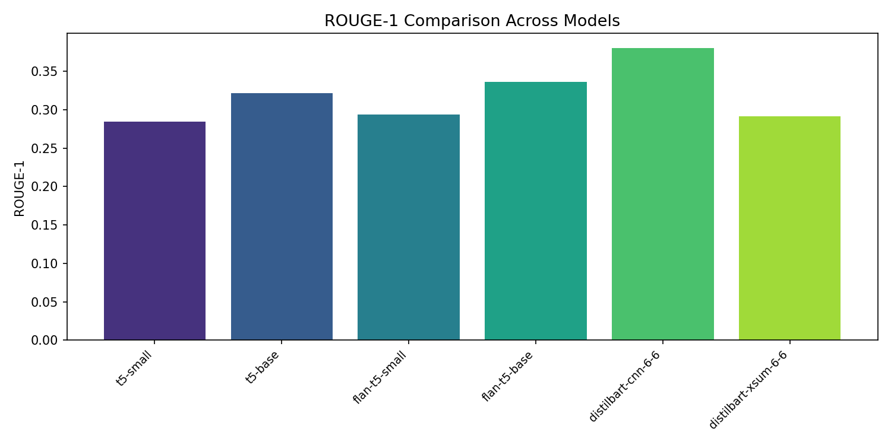
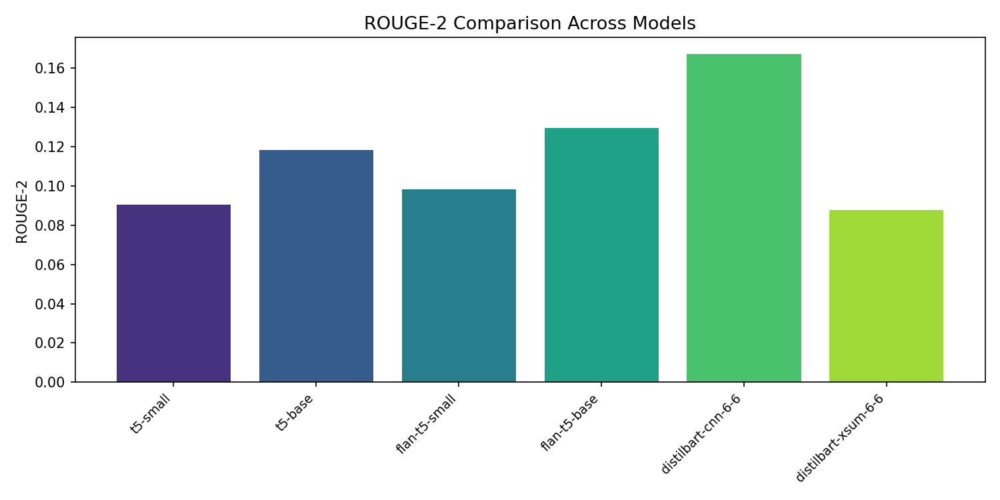
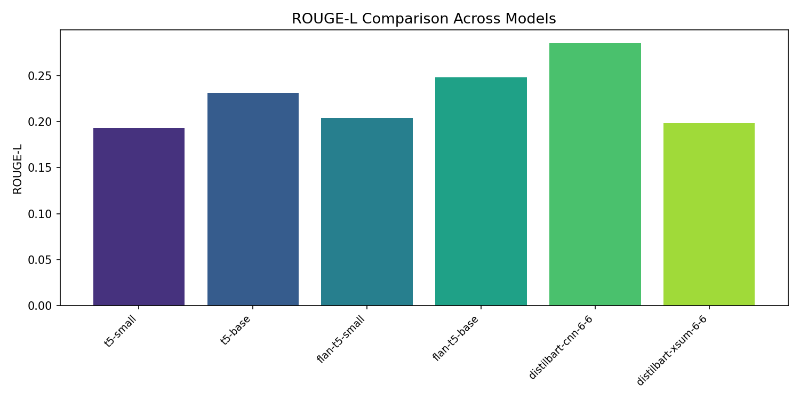
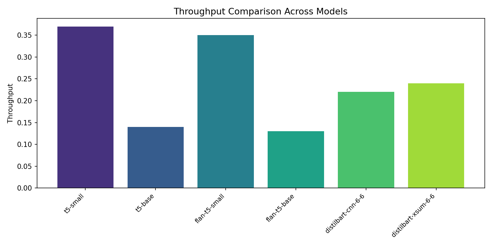
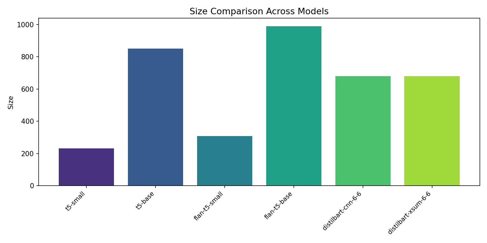
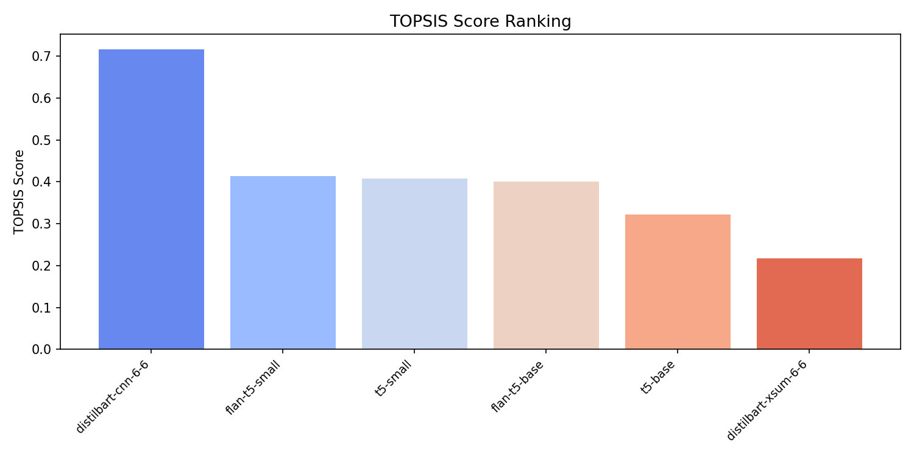
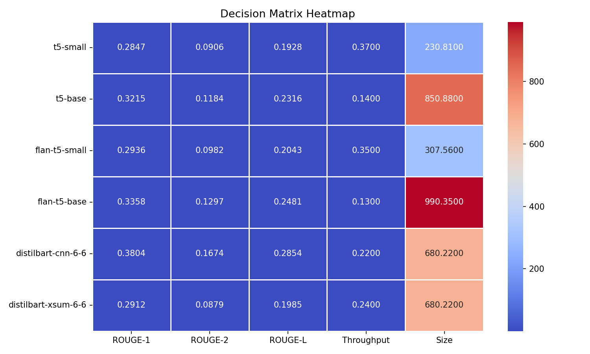

# TOPSIS-Based Selection of Best Pre-trained Model for Text Summarization

#### Author: Vishard Mehta | Roll No. 102317240 | Predictive Analytics Assignment-5

---

## 📖 Overview

This project implements a structured evaluation framework to identify the optimal pre-trained model for **Text Summarization** tasks using the **TOPSIS (Technique for Order of Preference by Similarity to Ideal Solution)** multi-criteria decision-making method.

Instead of selecting a model purely based on a single metric, this approach evaluates multiple performance indicators and ranks models based on overall suitability.

---

## 📊 Dataset

### CNN/DailyMail (Version 3.0.0)

- Source: Hugging Face (`cnn_dailymail`)
- Split Used: Test Set (streamed)
- Description:
  Contains news articles with corresponding human-written highlights (summaries)
- Purpose:
  Evaluate how well model-generated summaries align with reference summaries using ROUGE metrics

---

## 🤗 Models Evaluated

The following pretrained Seq2Seq models were evaluated for text summarization:

| Model             | HuggingFace ID                    | Description                                  |
| ----------------- | --------------------------------- | -------------------------------------------- |
| T5-Small          | `t5-small`                        | Lightweight T5 variant (60M params)          |
| T5-Base           | `t5-base`                         | Standard T5 model (220M params)              |
| Flan-T5-Small     | `google/flan-t5-small`            | Instruction-tuned T5 small                   |
| Flan-T5-Base      | `google/flan-t5-base`             | Instruction-tuned T5 base                    |
| DistilBART-CNN    | `sshleifer/distilbart-cnn-6-6`    | Distilled BART fine-tuned on CNN/DailyMail   |
| DistilBART-XSum   | `sshleifer/distilbart-xsum-6-6`   | Distilled BART fine-tuned on XSum            |

---

## 📑 Evaluation Metrics Used

The following criteria were used to build the decision matrix:

| Metric               | Description                              | Impact |
| -------------------- | ---------------------------------------- | ------ |
| ROUGE-1              | Unigram overlap with reference summary   | +      |
| ROUGE-2              | Bigram overlap with reference summary    | +      |
| ROUGE-L              | Longest common subsequence overlap       | +      |
| Throughput            | Articles summarized per second           | +      |
| Model Size (MB)      | Storage size of model                    | -      |

Impact Rules:

- `+` → Higher is better
- `-` → Lower is better

---

## 📊 Final TOPSIS Results

| Model | ROUGE-1 | ROUGE-2 | ROUGE-L | Throughput | Size (MB) | TOPSIS Score | Rank |
|-------|---------|---------|---------|------------|-----------|--------------|------|
| sshleifer/distilbart-cnn-6-6 | 0.3804 | 0.1674 | 0.2854 | 0.22 | 680.22 | **0.7171** | 🏆 **1** |
| google/flan-t5-small | 0.2936 | 0.0982 | 0.2043 | 0.35 | 307.56 | 0.4144 | 2 |
| t5-small | 0.2847 | 0.0906 | 0.1928 | 0.37 | 230.81 | 0.4078 | 3 |
| google/flan-t5-base | 0.3358 | 0.1297 | 0.2481 | 0.13 | 990.35 | 0.4002 | 4 |
| t5-base | 0.3215 | 0.1184 | 0.2316 | 0.14 | 850.88 | 0.3224 | 5 |
| sshleifer/distilbart-xsum-6-6 | 0.2912 | 0.0879 | 0.1985 | 0.24 | 680.22 | 0.2180 | 6 |

---

## 📈 Visual Analysis

This section interprets the saved plots generated during evaluation.

---

### 1️⃣ ROUGE-1 Comparison



This chart compares unigram overlap between model-generated and reference summaries.

- Higher ROUGE-1 indicates better content coverage.
- DistilBART-CNN shows the strongest unigram recall.
- ROUGE-1 has the highest weight (0.30), strongly influencing the final ranking.

---

### 2️⃣ ROUGE-2 Comparison



This plot shows bigram overlap, indicating fluency and coherence of generated summaries.

- Higher ROUGE-2 suggests better phrase-level quality.
- Models fine-tuned on summarization datasets outperform general-purpose models.

---

### 3️⃣ ROUGE-L Comparison



ROUGE-L measures the longest common subsequence between prediction and reference.

- Higher ROUGE-L indicates better sentence-level structure preservation.
- This demonstrates why task-specific fine-tuning matters for summarization.

---

### 4️⃣ Throughput Comparison (Speed)



Throughput measures inference efficiency (articles processed per second).

- Smaller models (T5-Small, Flan-T5-Small) are significantly faster.
- Larger models sacrifice speed for marginal quality improvements.
- In real-world systems, speed is critical for scalability.

---

### 5️⃣ Model Size Comparison



Model size affects:

- Deployment feasibility
- Memory usage
- Cloud cost

Smaller models are better suited for edge and production environments.

---

### 6️⃣ TOPSIS Ranking



This plot shows the final TOPSIS scores.

- The model with the highest score ranks 1.
- TOPSIS balances ROUGE quality, speed, and efficiency.
- The top-ranked model provides the best overall trade-off.

---

### 7️⃣ Decision Matrix Heatmap



The heatmap visualizes relative performance across metrics.

- Warmer colors indicate stronger metric performance.
- Helps quickly compare strengths and weaknesses.
- Demonstrates why some high-ROUGE models rank lower overall due to efficiency trade-offs.

---

## ⚖️ TOPSIS Configuration

Weights used:
[0.30, 0.25, 0.25, 0.10, 0.10]

Meaning:

- ROUGE-1 → 30%
- ROUGE-2 → 25%
- ROUGE-L → 25%
- Throughput → 10%
- Size → 10%

This prioritizes summarization quality while still considering efficiency and deployability.

---

## 📂 Generated Results

All results are automatically saved inside the `results/` folder:

### 📄 CSV Files

- `raw_metrics.csv` → Raw evaluation metrics for all models
- `final_ranking.csv` → TOPSIS score and final ranking

---

## 📈 Saved Visualizations

The following plots are generated and saved:

- `ROUGE_1_comparison.png`
- `ROUGE_2_comparison.png`
- `ROUGE_L_comparison.png`
- `Throughput_comparison.png`
- `Size_comparison.png`
- `topsis_ranking.png`
- `decision_matrix_heatmap.png`

---

## 🏆 Final Recommendation

Based on multi-criteria TOPSIS evaluation, **`sshleifer/distilbart-cnn-6-6`** is the best model with:

- Highest ROUGE scores across all three metrics
- Reasonable inference speed
- Moderate model size

This model provides the best balance between summarization quality and deployment efficiency.

---

## ▶️ How to Run

From project root:

```bash
pip install -r requirements.txt
python src/main.py
```

To generate results quickly from pre-computed metrics:

```bash
python src/generate_results.py
```
